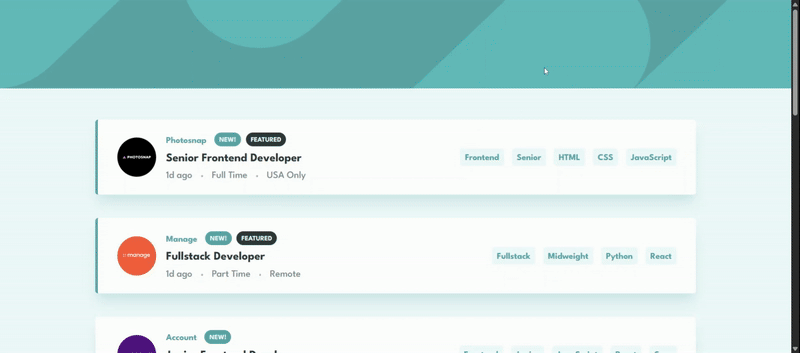

# Frontend Mentor - Job Listings with Filtering

This is a solution to the [Job Listings with Filtering challenge on Frontend Mentor](https://www.frontendmentor.io/challenges/job-listings-with-filtering-ivstIPCt).  
Frontend Mentor challenges help you improve your coding skills by building realistic projects.


<a href="https://denislav-dimov-static-job-listings.vercel.app">
  
</a>

## Table of Contents

- [Overview](#overview)
  - [The Challenge](#the-challenge)
  - [Preview](#preview)
  - [Links](#links)
- [Getting Started](#getting-started)
  - [Prerequisites](#prerequisites)
  - [Installation](#installation)
  - [Usage](#usage)
- [About](#about)
  - [What I Learned](#what-i-learned)
  - [License](#license)
  - [Author](#author)

## Overview

### The Challenge

Users should be able to:

- View the optimal layout for their device's screen size
- See hover states for all interactive elements
- Filter job listings based on selected categories
- **Bonus by myself**
  - Navigate from the listings to individual job-offer pages

### Preview



### Links

- Solution URL: https://www.frontendmentor.io/solutions/job-listings-with-dynamic-job-offer-pages-qWBTEYCw5g
- Live Site URL: https://denislav-dimov-static-job-listings.vercel.app/

## Getting Started

Follow these steps to set up and run the project locally.

### Prerequisites

Make sure you have the following installed:

- **Node.js** (v18 or higher)
- **npm** (v9 or higher)

### Installation

Clone this repository and install dependencies.

```bash
git clone https://github.com/Denislav-Dimov/static-job-listings.git
cd static-job-listings
npm install
```

## Usage

Run the app in development mode:

```bash
npm run dev
```

Then open your browser at http://localhost:5173.

## About

### What I Learned

This was my first React project that I decided to build.
I learned how to manage state effectively and how to render dynamic components.
I also practiced passing props between components, using conditional rendering for filtering and how to implement dynamic routing for the individual job-offer pages.

### License

This project is licensed under the MIT License - see the [LICENSE](LICENSE) file for details.

### Author

- GitHub - [@Denislav-Dimov](https://github.com/Denislav-Dimov)
- Frontend Mentor - [@Denislav-Dimov](https://www.frontendmentor.io/profile/Denislav-Dimov)
